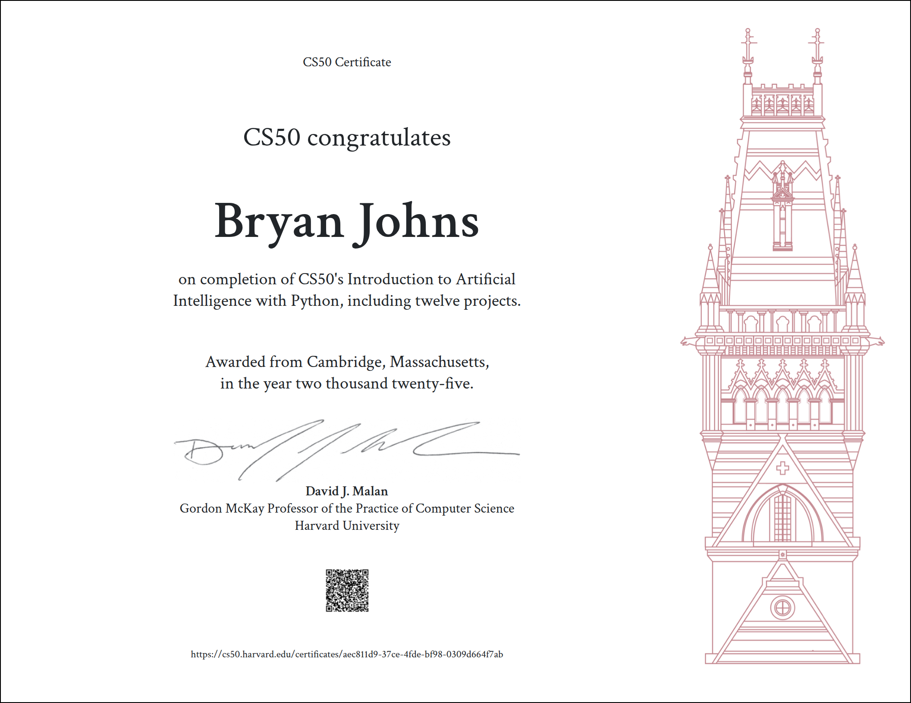

# Red-Light-Green-Light: Decoding Traffic Signs with Computer Vision

*Giving a computer eyes: classifying road signs with deep learning.*

🔗 [Final Report](https://johbry17.github.io/Red-Light-Green-Light/)  

## Table of Contents  
- [Project Overview](#project-overview)
- [Features](#features)
- [Tools & Technologies](#tools--technologies)
- [Usage](#usage)
- [Gallery](#gallery)
- [Certificate](#certificate)
- [References](#references)
- [License](#license)
- [Acknowledgements](#acknowledgements)
- [Author](#author)

## Project Overview  
Computer vision is the art of teaching a machine to "see." This project trains a convolutional neural network (CNN) to classify German road signs from the [GTSRB dataset](https://benchmark.ini.rub.de/gtsrb_news.html).  

The workflow includes:  
- Data preprocessing and augmentation  
- Model building with CNNs  
- Training, validation, and testing  
- Performance evaluation with accuracy, confusion matrix, and misclassification review  
- Insights on strengths, weaknesses, and possible applications for real-world traffic systems  

## Features  
- End-to-end CNN pipeline for image classification  
- Image preprocessing and augmentation for robustness  
- Visualization of training and validation accuracy/loss  
- Confusion matrix to assess model performance  
 - Misclassification histogram to visualize error patterns 
- Example predictions with correct/incorrect classifications  
- Executive-style summary of model outcomes  

## Tools & Technologies  
- **Language:** Python  
- **Libraries:** TensorFlow/Keras, NumPy, pandas, matplotlib, scikit-learn  
- **Environment:** Jupyter Notebook  
- **Dataset:** German Traffic Sign Recognition Benchmark (GTSRB)  

## Usage  
To explore the project:  
1. Clone the repository.  
2. Open and run the notebook `./notebooks/model_analysis.ipynb` for model building and evaluation  
3. To generate or customize the figures for the executive summary, run `./notebooks/executive_summary_visuals.ipynb`
4. See final results and conclusions published to the web [here](https://johbry17.github.io/Red-Light-Green-Light/).  

## Gallery  

*Class imbalance: Label distribution is highly skewed across classes.*  

*Dataset diversity: representative image for each label.*  

*Validation and training curves: best model vs. baseline.*  

*Confusion matrices: best model noticeably reduces off-diagonal errors.*  

*Frequent errors: visually similar signs are misclassified.*  

*Histogram: overkill model’s errors are less confident and more frequent.*  

## Certificate  

Completed during the course of HarvardX's [CS50’s Introduction to Artificial Intelligence with Python](https://cs50.harvard.edu/ai/).  The project began as a simple assignment and grew into a portfolio piece.  

## References  
- Data provided by the [German Traffic Sign Recognition Benchmark (GTSRB)](https://benchmark.ini.rub.de/gtsrb_dataset.html).  
- See also _Man vs. Computer: Benchmarking Machine Learning Algorithms for Traffic Sign Recognition_ research paper [here](https://www.sciencedirect.com/science/article/abs/pii/S0893608012000457?via%3Dihub).  

## License  
MIT License © 2025 Bryan Johns. See [LICENSE](LICENSE) for details.  

## Acknowledgements  
- Thanks to the GTSRB team for making the dataset publicly available.  
- Thanks to HarvardX’s CS50 AI for the initial inspiration.  

## Author  
Bryan Johns, September 2025  
[bryan.johns.official@gmail.com](mailto:bryan.johns.official@gmail.com) | [LinkedIn](https://www.linkedin.com/in/b-johns/) | [GitHub](https://github.com/johbry17) | [Portfolio](https://johbry17.github.io/portfolio/index.html)
 
